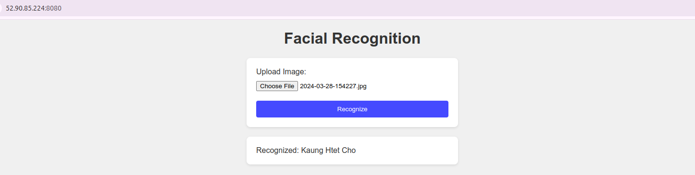
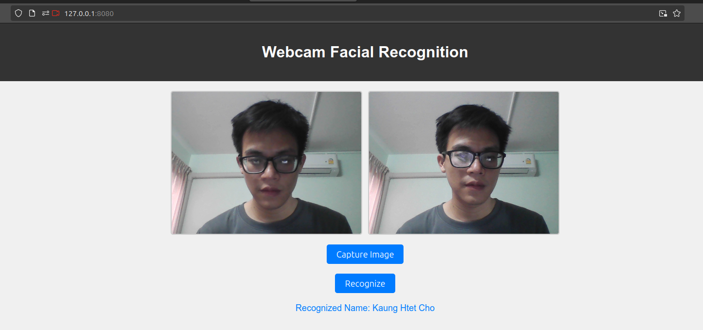

# Face recognition on AWS 
Cloud computing project from AIT

### Progress report 

- Attached well-architected framework at the pdf folder >> Progress_Report's chapter 4
- Attached estimated cost calculated with aws pricing calculator at the pdf folder >> Progress_Report's appendix

### Setup

- Create s3 bucket >> run the create s3 bucket command from code/aws_cli_commands.txt
- Create dynamonDB >> run the create dynamoDB table command from code/aws_cli_commands.txt
- Create rekognition >> run the create rekognition collection command from code/aws_cli_commands.txt
- *don't forget to change the collection, table and bucket names according to your favourite*
- AFter that, create a EC2 instance and change inbound rules to be able to access HTTP and Custom TCMP at port 8080 from anywhere
- userdata script is uploaded for bootstrapping

#### Testing can be accessed from two location

- code/app/app.py --> works on ec2 instance server
- test/app2.py --> only available at local server

###  Web app development (In progress)

- Ask user to uploade the selfie image of them 
- If the user's image is registered, aws rekognition will give out their respected name

<figcaption> Web app running on EC2 instance server http://52.90.85.224:8080/ </figcaption>
 

My webpage works, if only needed to ask the user to upload their image in local but *EC2 free tier eligibile instance can not access webcam and still trying to figure it out*

- As soon as the webpage loaded, open webcam and then ask the user to capture the image
- By using that captured image, model will looking for the matched data in aws dynamo db that stored registered images and names
- If the face is in database, it will shows up recognized
- Below sample screenshot webpage is running on the local and it works 

<figcaption> Web app running on local server http://127.0.0.1:8080/ </figcaption>
 